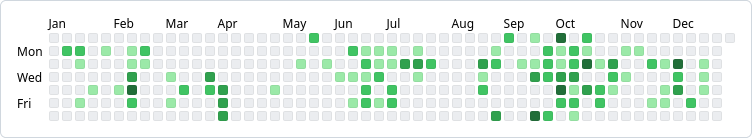

# activity-graph

A low level and stylable Web Component to display an activity graph.

## Demos and screenshots

Here are some demos:

- [Raw HTML/DOM demo page with multiple theme examples](https://hsablonniere.github.io/activity-graph/)
- [React 18 demo page](https://codesandbox.io/p/sandbox/activity-graph-react-18-528pn6)
- [React 19 demo page](https://codesandbox.io/p/sandbox/activity-graph-react-19-3zcmmw)
- [Angular 18 demo page](https://stackblitz.com/edit/cxeeyf)
- [Vue.js 3.4 demo page](https://play.vuejs.org/#__PROD__eNq1ne2O28YZhW+FUIBsAqy0IrWf8jaI4zpoAsQp6rZ/skHBlWYl2hIpkNTabuB77xlyxKFcHWYovQMIiVfk8uHXPHwPZ8j9Y/Bysxk9b9VgOrgvZnmyKYNCldvNdw9pst5keRmcfb8s4sdVlqaJytVFPCuT56T8NFzk8WZ59qKZb5GUy+3jqywt8+RxWyZZWgRPebYOzkYX9bThrD1x9K7IUv379xc1GEj8UKr1ZhWXCj8Fwf0yrP6Pf82yuQqK8tNK/eVh8BjP3i/ybJvOscxVlk+Dr5RSL4JNPJ8n6WIajEehWuO/0ZVavwges3yu8mEez5NtoSfqrx8G3329Kl/sb8/Xi/LF/YVmGe6/tworGszVOqtW6MKs0f3+79UzB8FsFRcFVrDe4IfB7vsPSr2fx5+GSxVjTfQcxRI7zc6wxq5ZDlfJOin1VL0H7MRVnC7wpUrtV0UZ5+VwjtkwIRpHk+E4xMfOoLBv2pPDaDhpTZ5iWtys6N5Rw465/+IwY5PvL1pHBj9WhwL/3J9xVC8v+ENzhsMi+a+aBuF48xHHOQiegBk+xetk9WkaDOPNZqWGxacCCz4Pflgl6ftf4tnb6ucfMed5cPZWLTIV/OunM/z7TVZmwds4LfDD39TqWZXJLD4PXuZJvDoPCkwYFipPns7rTTzDib1SwSt9egSv19m7RC9kt0DzTbVWi3gzDSZmFetTBeu8+RgU2SqZB1/Nx/ObuWpNbZ1Ikxt9gulJzamHE6/6Yp4U2F3Y0CTFpinsn2SOCZ/13ju406bTDY7pN/unyrfYnK656/PGzFvv9movmz0fVZslzMScBrVUyWJZToPnOP+mPtrfVttebfDhiX3XpQaZvTvM60Waht17acOhelapWWZzgNIs1Yf3T5d1YF/vtjHcnT97W26+PbDg3/ba+9k6mc9X6uz3P+WV6mM5jFfJIp0GM5WWKndZcXvAvjiB69MjCLJtWa149vQE+6Nt4vRvT9hrD+Fj+BRNxk/VDB+SebnsfYz1EdF2iofj3YodMPqjmj+N+y0u5Iu7e1R38W2/xUV8cZfj2eX1pN/iJnxxk3EcXjqdhXZxl3xxUXitJne7xeEKW9l6cD6oL9bDdbyprr+47FeLeDATIP9pvVD9XdeVX8/4MFiW5aaYXlyoYj0qlhddv/B9OBqPxvUVCGv1GStTFqgInpLFF6syy9abZKXyXzfmetRapXi1yj78XH1X5ltlZI/fWarZ+wPfvys+1mv691zh8vCMq2ozDZfQhcI1WE9+/fYNmlZr4jqbb1eYu2PiPxRaRHXNrGf7AUcAq92ar1rbn6o9C3v9s3j9sVRpsdsovaLV3qjmfxigDHvVsel2dSejy9ZepMWV3aPtAqG1RH0+VYzfHgatJvkw+N3uo6Tc7YU3WbDHCLI0+DlOt3H+KQiLcmQOrdmYBhl5QkbpnCEnnpCTnCIvPSEvyyVDXnlCXnHktSfkNUfeeELecOStJ+QtR945INGQDiKvOPGOEkNsgB8TjDnTm31CzvSlnzDiTF/+CSec6UtAITdQ6MtAIVdQ6KIg1lIuO5BcQaGLgnBqH0RGHUiuoNCXgkLuoNDFQUcxuYUiFwsdsWsjLqHIl4QiLqHIWw3EJRT5klDEJRT5klDEJRT5klDEJRS5SIidtuEeco/IHRT5KoMiLqHIl4QiLqHIl4QiLqHJKRLiR3PCHaRvxPoJKMxBkXz0+1E95p3ZD0xp7zVMFv7AlPZew2TpD0xp7zVM5j0wpb3XMJn3wJTOfw2TmQ9MafM1TGY+MKXN1zCZ+cB0MZ+7hRoi814kHwGtEZj6APWnIe4+8RBooawAA9RFREccUBoCgXTx0DFIriGnDIg9cRB507VnuYacMiB2xeHNHHdBuYecUmCPWzSWyT0kHgMtlItIPAdaKHeRUxA8Zu/SJAimi4qOaC00CALpryDiIhJPghbKVSQeBS2Uy0g8C1oot5FTGDwOym0kngctlOtIPBBaKNORjkvC0F/ifLakoUVvqBcgSyz64wXI4go+0m2zBrJ2iY90u6yBrE3iI90mayBrj/hIt8cayNoiPi5t0f3iVeM6WqF0UVADWUGA4WrCd4ZNq2fVAICePMOKAT0izw+RVQIg+jENTSQg+lENDSQg+nENjSMgntIldaB2NUAuG6cocsQmctuIBxFD5MIRTyGGyI3jFEGOuO5z5Yh3RRkiV454/jBErhzx8GGIXDniycMQuXLEY4chcuWIZw5D5M4RDxyGyJ0jnjYMkTvHqfOJ3cu6pUCuHKeeJ3blmNDCnxtHvOPJEJlxLuXj28tNnqxofANQWnE1kMU3AKUNVwNZfANQWnA1kPkNQGm/1UCmNwBd9NajIdY8JjfwXOTGeNeMx9QGnovaem8fExt40sVUDWRiu5TvWjKtnpkNRE+e4WYTj2+GyGopEP2YhsY3EP2ohsY3EP24hsY3EKVrKUPkuhHPb4bIhSOe3wyRK0c8vxkid454fjMXfu4c8fxmiNw54vnNELlzxPObIXLniOc3Q+TOEc9vhsidI57fDJE7Rzy/GSJ3jnh+M0TuHPHBg4bIneMU4I6o/Zlzrnx0h/ERfMDJ3zDig/eAk79bxMftAXfKeJmDnQx8xB5o8reJ+GA94OTvEfFxesDJ3yDiQ/SAk787xEfnASd/O5oPzbuSz09VK+dW8dD51TEgDzwfWqHJCTwfXqG5CTz5e9Ado/DA86EWmpnAk30AoqJxtXjo7+oYdgeeD7fQrASeD7nQpHTlo6erY6AdeC526XWbu2OQHXBeahYuFw9dXB1D68DzIRcaj8DzIRcajsDzUbjQaASeD73QYASeD73QWASeD73QUHQl/TxVVcJzuXjo0up4jurawys0tqmiCQw88WdHNY9FMPDEnxvVPJbBwBN/ZlTzmM3AE39eVPOYzcATf2eG5jGbgSf9tLrGMZkBJ/6QqOYxmYEn/oCo5jGZXXt4T0bV3JnPAPTjFy40pyzW540KFY+VS+B5EQwNYwDKPhVV47hg5N+KUQG5YYTDWI3jghFPYzWQK0b+ZRgVkDvGKY/13aFcMSc9+3QgHtUXeG4Y4eeeahz3i1Mc6/Nuo4rH/eIUx/r6jMYx8LwUMDSPAehFMDSQAehBMDSPAXdKBcNwXC9Ocax38+N2kX/FRQXkfpF+v0VVzzO93PgISCveRQWefEACjwUk8GSf665oLB6BJl28gMbUApq8WsBjZgFP+NGJCsfMAtwpz3AfbOrAMbMAJ1+4gMfMAp68WcBjYrnxkY10S+dqccpGPV42UPNY6QKeF7XQbASgfDbSQFa8AChfvGggN4yHdKSBXDHiw/tqIJfMSa8LJMam6Qi4U8YS0zbBJSMejjSOO0a8r6q+unPHyL8fsAJyyci/HLACcsnIvxmwAnLJeEhIGsgl45SQ+l7naUACz4tjaEQCUP4ejAZyy8i/C7ACcs14SEkayEUjPpSvLuy5aORfAlgBmWhuPTyKtV1si5JGMxDFhyvXRBbOQBQfrlwTWUADUXy4ck1kdgNRfLhyTWR+A1F8uHJNZIIDUXy4ck1khgNRfLhyTWSKA1F8uHJNZI679fBYljEAsxyQvqTDPSf/YJZBspIKSE/aockNSE/eodkNSE/ioekNSE/mofkNSE/qoRkOSE/uoTEOSE/yoVHu1sMDWqYa4PaRf0LLILl9nOJcn2eJDZHLxynPuSfyHZCrxynP9YhXOyI3j/wTWgbJzSP/iJZBcvPIP6NlkNw8Trmux2ihHZGLxynY9eie3RG5d+Qf0jKZgHtHPNvtkMw7d/Lp7q3a4A9xPqqcBjxAhWVnmSzigSncv2+ZLOSBKV1sWSiTHqDS0rNQpj1ApbVnoUx8gEqLz0KZ+gCVLroslNkPUOmyy0KZAO/kY19LDcyBoHoUEtegU/jrcUFrQVkFBqh0/GtRWRkGqj8p0RAIqj8r0RwIqj8t0SgIqmxXXovJtSSeBVtU7qWTevW6mw33klMgPK564FoSj4QtKteSeCdfi8q95JQM6R9K6KyVaDwE1Z+XaEQEVbjPrwXlWnIKicdBuZWcYuJxUK4l8Q7AFpVrSbwXsEXlXjrptYzdCYN4KRy75TfaVg/Y8NdZmXWkN408pVb6/8vbDkiimwbK3qnaAUlu00AXFfW4wuyIREOa6KIhehj3t3EPSSSkkcJ/EnVHJAbSROm8tkMS/2iktH92SCIfjRT+o8w7IhEPiE5B7QgiS2kaecqQyi7rkFpII/1oh+UzTTzlltGBK2aDJEWQRgq/WqhBcvU4JbNjtpKrR/jRs4bI1eMUyfqUtA2Tu0c8kjVMLh+nQHZMu+T2Ee+fawoCrh/xNNYwuX/Es1jD5AYSH3PZMLmCnHLYEeUdN5B4N13D5Ao6KYJ1XDNZANNI4T8F2CC5gsTjV8PkChIPXw2TO0i8r67JCNxBTp11Pd7G3SCZgkK3sNfjUv0me+7sqtNI2aqrIbK0B6K08xomC3xgSt97apjMemBKW69hMuuBKVt4NUQmPRClM1/DZNYDU3h0QoNk0gNSWnoNk0kvlO+fszpg1gNUuvKyUO498aGZFspqL0Bl7zpZJCu9gPSmIZr/APXmIZoAAZXumLNQ7iLxIZoWymUkngItlOtIfJimhXIfiQdBWyxwH530ksgDud4yuY7Ek6CFch2JR0EL5UISzoIWyXUkHgYtlOtIfNSmhXIdiY/btFCuI+mRm5bJbSSeCC2U20j49SU2RDAXRW7xzB35VzXrTmcgSpuoYbJ8Bqa0iBomy2dgShdGDZOJCEzpLrmGyTwEpvBdqQbJLATkKX/E7MBtjAbJHASkdEnUMJmDwJR2UMNkCorkA5o1ApeQeECzUFYRAerNQzSgAepNRDSiAerNRDSiASrcRWeZXEXiCc1CuYzEE5qFch2JJzQL5T4Sfh+KRXIdOeWzI5A0nQHpqSKi4QxIfyURV5F4OLNQriLxAZMWylUkHs8slLtIPJ5ZKHeReDyzUO4i8Q47C+UuEs9nFsptJN5lZ2ME95H4A3YW2jLSQ4rP4Hzwn2eVF5hzMB1MRpejye3g8/8AjdyS+A==)
- [Svelte 4.2 demo page](https://svelte.dev/repl/9250addaaa7c4f1689b64603b2ac5939?version=4.2.18)

> [!NOTE]
>
> Keep in mind that the themes on the demo page and screenshots are just examples of what can be done.
> They're not released with this component, you will have to create your own theme.

### GitHub

Here's an example of my 2023 GitHub contribution graph.



### Serializd

Here's an example of my 2024 Serializd stats graph.

![[An activity graph representing a year with weeks as columns. Some days are colored with different tones for indicating how many TV show episodes were watched. It's the same theme as the one on Serializd.]](./screenshots/serializd-demo-screenshot.png)

### Monkeytype

Here's an example of my 2024 Monkeytype stats graph.

![[An activity graph representing a year with weeks as columns. Some days are colored with different tones for indicating how many tests were done. It's the same theme as the one on Monkeytype.]](./screenshots/monkeytype-demo-screenshot.png)

### Letterboxd

Here's an example of what could be my 2023 Letterboxd stats graph, if they had such a graph.

![[An activity graph representing a year with weeks as columns. Some days are colored with different tones for indicating how many movies were watched. It's following the general look and feel of Letterboxd.]](./screenshots/letterboxd-demo-screenshot.png)

## How to install?

### Via npm

This component is published on [npm](https://www.npmjs.com/package/@hsablonniere/activity-graph).
You can "npm install" it in your project with this command:

```bash
npm install @hsablonniere/activity-graph
```

### Via CDN

You can also directly use modern CDNs that exposes npm packages like JSDelivr:

```html
<script type="module" src="https://cdn.jsdelivr.net/npm/@hsablonniere/activity-graph/+esm"></script>
```

or esm.sh:

```html
<script type="module" src="https://esm.sh/@hsablonniere/activity-graph"></script>
```

## How to use?

Use the `<activity-graph>` custom HTML tag like this:

```html
<activity-graph start-date="2024-01-01" end-date="2024-12-31"></activity-graph>
```

### Attributes / properties

<table>
  <tr>
    <th>Attribute
    <th>Property
    <th>Type
    <th>Default
  <tr>
    <td><code>start-date</code>
    <td><code>startDate</code>
    <td><code>string</code> with <code>YYYY-MM-DD</code> format
    <td>A year ago
  <tr>
    <td colspan="4">First date of the graph
  <tr>
    <td><code>end-date</code>
    <td><code>endDate</code>
    <td><code>string</code> with <code>YYYY-MM-DD</code> format
    <td>Today
  <tr>
    <td colspan="4">Last date of the graph
  <tr>
    <td><code>data</code>
    <td><code>data</code>
    <td><code>ActivityGraphData</code>
    <td><code>null</code>
  <tr>
    <td colspan="4">Data object, see <em>Data</em> section below
  <tr>
    <td><code>lang</code>
    <td><code>lang</code>
    <td><code>string</code>
    <td>Document language (<code>lang</code> attribute on the <code>html</code> tag) or <code>en</code> if not specified
  <tr>
    <td colspan="4">BCP 47 language code used to translate weekday and month headers
  <tr>
    <td><code>week-start-day</code>
    <td><code>weekStartDay</code>
    <td><code>number</code>
    <td><code>0</code> (sunday)
  <tr>
    <td colspan="4">Number representing the first day of the week, from <code>0</code>0 (sunday) to <code>6</code> (saturday)
  <tr>
    <td><code>weekday-headers</code>
    <td><code>weekdayHeaders</code>
    <td><code>'none' | 'long' | 'short' | 'narrow'</code>
    <td><code>narrow</code>
  <tr>
    <td colspan="4">Format used for weekday headers (see <a href="https://developer.mozilla.org/en-US/docs/Web/JavaScript/Reference/Global_Objects/Intl/DateTimeFormat/DateTimeFormat#weekday">DateTimeFormat#weekday</a>) or <code>'none'</code> to hide them
  <tr>
    <td><code>month-headers</code>
    <td><code>monthHeaders</code>
    <td><code>'none' | 'long' | 'short' | 'narrow' | 'numeric' | '2-digit'</code>
    <td><code>short</code>
  <tr>
    <td colspan="4">Format used for month headers (see <a href="https://developer.mozilla.org/en-US/docs/Web/JavaScript/Reference/Global_Objects/Intl/DateTimeFormat/DateTimeFormat#month">DateTimeFormat#month</a>) or <code>'none'</code> to hide them
  <tr>
    <td><code>month-limits</code>
    <td><code>monthLimits</code>
    <td><code>'early' | 'middle' | 'late'</code>
    <td><code>late</code>
  <tr>
    <td colspan="4">When to start/end month headers:
      <ul>
        <li><code>'early'</code>: month headers start on week with first day of month and end on last full week
        <li><code>'middle'</code>: month headers start on week with first day of month and and end on week with last day of month (month headers will overlap), it's the best choice when <code>--activity-graph-month-gap</code> is used
        <li><code>'late'</code>: month headers start on week first full week of month and end on week with last day of month
      </ul>
  <tr>
    <td><code>month-position</code>
    <td><code>monthPosition</code>
    <td><code>'top' | 'bottom'</code>
    <td><code>top</code>
  <tr>
    <td colspan="4">Where to put month headers
</table>

### Data

The data can be set as a JavaScript object on the `data` property, or as JSON on the `data` attribute. It must respect the following type definition:

```ts
// Keys must be YYYY-MM-DD date strings
type ActivityGraphData = Record<string, ActivityGraphDataEntry>;

interface ActivityGraphDataEntry {
  // Used for the day "cell" inner text
  text?: string;
  // Used for the day "cell" `title` attribute, for tooltips and accessibility
  title?: string;
  // Used for the day "cell" `part` attribute, as in CSS shadow part for styling purposes
  parts?: Array<string>;
}
```

Here's an example:

```js
myActivityGraph.data = {
  '2024-04-01': {
    title: '2 contributions',
    parts: ['level-1'],
  },
  '2024-04-04': {
    title: '27 contributions',
    parts: ['level-4'],
  },
};
```

### Styling

By default, the component does not have any styles.
You'll have to rely on the different CSS parts and custom properties to create a theme.

> [!NOTE]
>
> - You can rely on the fact that the element has a `display: grid` and use properties like `gap` directly on it.
> - You can have a look at the demos and their respective themes to get some ideas on how to style the component.

#### CSS parts

| Part                   | Description                          |
| ---------------------- | ------------------------------------ |
| `weekday-header`       | Target any weekday header            |
| `weekday-header--even` | Target even numbered weekday headers |
| `weekday-header--odd`  | Target odd numbered weekday headers  |
| `month-header`         | Target any month header              |
| `day`                  | Target any day "cell"                |

> [!TIP]
>
> If you want to use a CSS shadow part, you'll need the `::part()` pseudo element like this:
>
> ```css
> activity-graph::part(month-header) {
>   text-align: center;
> }
> ```

#### Custom properties

| Property                          | Description                                                 |
| --------------------------------- | ----------------------------------------------------------- |
| `var(--activity-graph-month-gap)` | Spacing between months, can be any CSS unit, `0` by default |

## Why this project?

I really like this way of visualizing a whole year of data at once.
Watching such graphs on [GitHub](https://github.com/), [Serializd](https://www.serializd.com/) or [Monkeytype](https://monkeytype.com/), I grew a need to have a similar dataviz for other services where I track and log stuffs like [Letterboxd](https://letterboxd.com/) or [fitbit](https://fitbit.com).
I wondered how easy it would be to create my own component and that's how I went down this rabbit whole.

In the end, I restarted from scratch 3 times to try different ideas to handle the dates and the CSS grid.
It wasn't a simple problem to tackle but I had lots of fun working on this.

### Design decisions

I started the project as a vanilla Web Component, without any dependency.
I guess I was wondering how small the final bundle would be, I achied something close to `1.6kb` (minified and compressed).
My code was not that easy to read and I had no support for properties, just attributes.
A few commits later, I quickly realized I was recreating a very dumb, verbose and unefficient version of [lit](https://lit.dev).
That's when I decided to add lit as the only dependency.
In the end, the component code + lit is `6.4kb` (minified and compressed).

I wanted something based on CSS grids without any styles by default so that anyone could reuse it and apply their own theme.
At first, you could specify some style properties on the data object but I replaced it with CSS shadow parts to maximize styling in the CSS.

### Other similar projects

I created this project without looking at the competition but obviously many smart people tried before me.

[Mario Hamann](https://github.com/mariohamann) also made a Web Component and his approach (a11y, WASM, SSR...) is very interesting!

- GitHub project: https://github.com/mariohamann/activity-graph
- Article: https://mariohamann.com/activity-graph-component

And of course, there are plenty of framework specific components for React, Vue, Svelte:

- https://github.com/Angstboksen/date-activity-graph
- https://github.com/AyushSaini00/github-contribution-graph
- https://github.com/KaranGulve4342/react-github-contributions
- https://github.com/cairongquan/contriGraph
- https://github.com/charpeni/sync-external-contributions
- https://github.com/grubersjoe/react-activity-calendar
- https://github.com/grubersjoe/react-github-calendar
- https://github.com/marcelovicentegc/react-github-heatmap
- https://github.com/razorness/vue3-calendar-heatmap
- https://github.com/scottbedard/svelte-heatmap
- https://github.com/srivenkat13/github-calendar-component
- https://github.com/uiwjs/react-heat-map
- https://github.com/x3388638/github-calendar-graph
